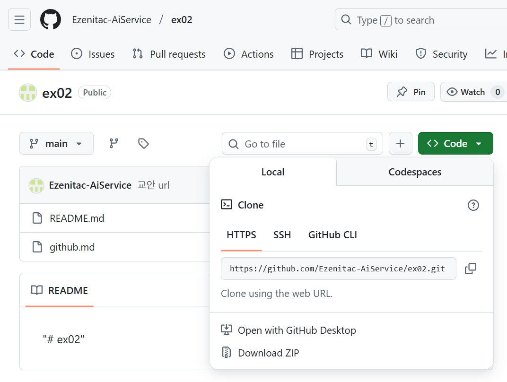

### 내 컴퓨터의 git 저장소로 github 저장소를 초기화
  + github에 새로운 저장소 생성하기
  + 내 컴퓨터의 git 저장소에서 github 연결하기
    ```bash
    git remote add origin https://github.com/계정이름/저장소이름.git
    git branch -M main
    git push -u origin main
    ```
  + 여러분은 주소 부분에 여러분의 github 저장소 주소를 넣어야 합니다

---

### github에 새로운 저장소를 생성하면서 내 컴퓨터에 새로운 git 저장소로 연결하기
  + github에 새로운 저장소를 생성
  + 내 컴퓨터에 새로운 저장소를 생성할 폴더로 이동

    ```bash
    echo "# ex02" >> README.md
    git init
    git add README.md
    git commit -m "first commit"
    git branch -M main
    git remote add origin https://github.com/계정이름/저장소이름.git
    git push -u origin main
    ```

---

### github의 저장소를 내 컴퓨터에 복제하기
  + 생성되서 사용중인 github 저장소로 이동
  + code 버튼을 클릭하고 저장소 주소를 복사
  + 
    ```bash
    git clone https://github.com/계정이름/저장소이름.git
    ```
  + 저장소 이름의 폴더가 생성되면서 git 저장소가 만들어짐

---

### git 저장소의 작업 내역을 github으로 전송하기

+ **작업 시작 전에 반드시** github 저장소의 내용으로 git 저장소를 갱신
  ```bash
  git pull origin main
  ```
+ 파일 변경 작업
  + add
+ 커밋
  + commit
+ github 저장소로 보내기
  ```bash
  git push -u origin main
  ```

---

+ pull 작업 이후에 push 해야 합니다
  + pull을 통해 
  + github 저장소의 내용으로 git 저장소를 최신화
    + github 저장소 내용과, git 저장소 내용이 충돌이 발생할 경우
    + 충돌을 해결해야, push가 가능합니다

```bash
git pull origin main
git push -u origin main
```

https://github.com/Ezenitac-AiService

---

### git 저장소와 연결된 github 저장소 확인하기

+ 연결된 github 저장소 확인
  ```bash
  git remote -v
  ```
+ 연결된 github 저장소 연결 해제하기
  + 보통 이름은 origin
```bash
git remote remove 저장소이름
```
+ git 저장소와 github 저장소 연결하기
  + 전혀 다른 저장소와 연결하는것은 안됩니다
  + github 저장소를 origin으로 지칭하는것은 관습입니다
  + 다른 이름으로 변경해도 무방합니다
  + 다만 이름을 변경하면 
    + git push -u 변경한이름 main
    + git pull 변경한이름 main
```bash
git remote add origin https://github.com/계정이름/저장소이름.git
```
